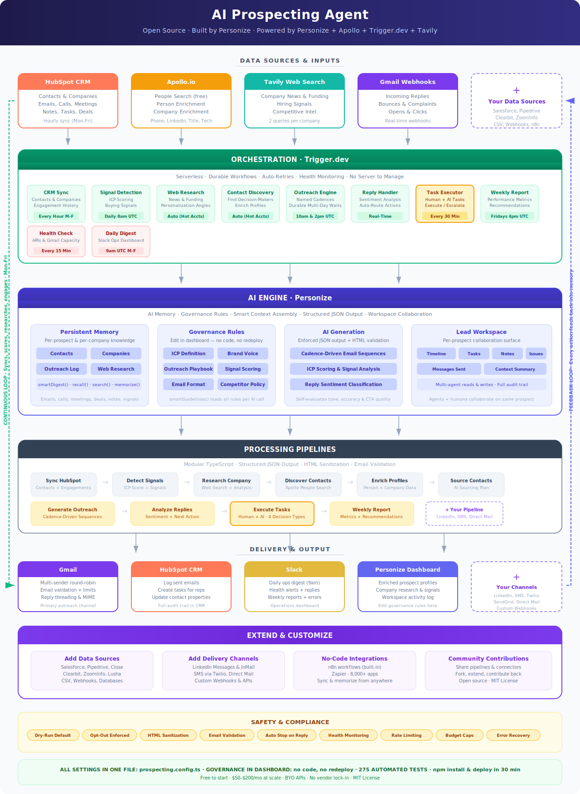

<h1 align="center">AI Prospecting Agent</h1>

<p align="center">
  <strong>Open-source alternative to HubSpot Prospecting Agent, Artisan, 11x, and AI SDRs — with full customizability at a fraction of the cost.</strong>
</p>

<!-- Badges -->
<p align="center">
  <a href="LICENSE"></a>
  
  
  <a href="#contributing"></a>
  
</p>

<!-- Early Access Banner -->
<p align="center">
  
</p>
<blockquote align="center">
  <strong>Early Access</strong> — This project is under active development. APIs and configuration may change.<br/>
  Want to collaborate closely? <a href="CONTRIBUTING.md#collaborate-closely">Let us know</a> · <a href="CONTRIBUTING.md#sponsors">Become a sponsor</a>
</blockquote>

<!-- Cost hook -->
<p align="center">
  <em>Replace your $2,000-5,000/mo AI SDR with $50–$200/mo in API costs.</em>
</p>

<!-- Navigation -->
<p align="center">
  <a href="#getting-started">Getting Started</a> &middot;
  <a href="#how-it-works">How It Works</a> &middot;
  <a href="#account-strategizer--coordinated-multi-contact-outreach">Account Strategy</a> &middot;
  <a href="#csv-import--no-crm-required">CSV Import</a> &middot;
  <a href="#why-open-source">Why Open Source</a> &middot;
  <a href="#extend-it">Extend It</a> &middot;
  <a href="ROADMAP.md">Roadmap</a> &middot;
  <a href="#community">Community</a>
</p>

---

---

<!-- Positioning -->
<blockquote>
<p>Most AI SDR tools charge $2K–$5K/mo for a black box you can't inspect, can't customize, and can't leave. This agent gives you the same pipeline — open source, fully customizable, and you own every line of code.</p>
</blockquote>

<!-- Feature grid -->
<table>
  <tr>
    <td align="center" width="20%"><strong>AI Email Writer</strong><br /><sub>Multi-email sequences with company-specific personalization, enforced brand voice, and self-evaluation</sub></td>
    <td align="center" width="20%"><strong>Signal Detection</strong><br /><sub>AI scores accounts against your ICP, detects buying signals, and surfaces hot accounts daily</sub></td>
    <td align="center" width="20%"><strong>Account Strategy</strong><br /><sub>Coordinates outreach across all contacts at a company — prevents carpet bombing, adjusts tone, blocks bad timing</sub></td>
    <td align="center" width="20%"><strong>Multi-Channel</strong><br /><sub>Email + LinkedIn (via HeyReach) + AI voice calls (Bland.ai, Vapi, ElevenLabs) — sequenced and coordinated</sub></td>
    <td align="center" width="20%"><strong>Reply Handling</strong><br /><sub>Classifies intent across all channels (email, LinkedIn, call transcripts), acts automatically, alerts your team</sub></td>
  </tr>
</table>

---

Built with ❤️ by the <a href="https://personize.ai" target="_blank">Personize</a> team.

**Powered by:** [Personize](https://personize.ai) (AI memory & governance) &middot; [Apollo.io](https://apollo.io) (contact discovery) &middot; [Trigger.dev](https://trigger.dev) (durable workflows) &middot; [Tavily](https://tavily.com) (web research)

**Email delivery:** [Smartlead](https://smartlead.ai) (default — managed deliverability) &middot; SendGrid &middot; Gmail API &middot; Manual HubSpot tasks &middot; [add yours — PRs welcome]

**LinkedIn automation:** [HeyReach](https://heyreach.io) (API-based — connection requests, messages, InMails, follows) &middot; Manual HubSpot tasks

**AI voice calls:** [Bland.ai](https://bland.ai) &middot; [Vapi](https://vapi.ai) &middot; [ElevenLabs](https://elevenlabs.io) &middot; Manual HubSpot call tasks

**Also works with:** [Clay](https://clay.com) &middot; Salesforce &middot; [add yours — PRs welcome]

**Data sources:** HubSpot &middot; Salesforce &middot; CSV &middot; Clay &middot; [Personize Zapier](https://zapier.com) (memorize from 8,000+ apps) &middot; [add yours — PRs welcome]

**AI-native setup:** Ships with [Skills](.agents/skills/) — onboarding wizard, diagnostics, pipeline builder, and more. Point your AI coding assistant (Claude Code, Cursor, Windsurf, Copilot) at this repo and it configures, customizes, and extends the agent for you through guided conversation. No manual config editing required.

---

## What Is This?

A fully autonomous prospecting agent that runs your outbound pipeline end to end:

1. **Syncs your CRM** — Pulls contacts, companies, and engagement history from HubSpot, Salesforce, Clay, or CSV files
2. **Scores accounts** — AI evaluates each company against your Ideal Customer Profile and detects buying signals
3. **Researches hot accounts** — Searches the web for funding rounds, hiring surges, product launches, and competitive intel
4. **Discovers contacts** — Finds decision-makers at high-scoring accounts via Apollo
5. **Coordinates account strategy** — AI evaluates all contacts at a company together, prevents carpet bombing, adjusts tone for engaged accounts, and blocks outreach during negative events
6. **Writes personalized emails** — Generates multi-email sequences with enforced JSON output, HTML sanitization, and email validation — referencing specific facts about each prospect
7. **Sends LinkedIn outreach** — Adds leads to HeyReach campaigns for automated connection requests, messages, and InMails. Receives webhook events when connections are accepted or replies come in
8. **Makes AI voice calls** — Generates call scripts and triggers outbound calls via Bland.ai, Vapi, or ElevenLabs. Receives post-call transcripts, analyzes outcomes, and takes action
9. **Manages sequences** — Named cadences (aggressive, standard, enterprise) auto-selected by ICP score, with smart timing and durable waits. Multi-channel sequencing: Email 1 → LinkedIn → Email 2 → Call → Email 3
10. **Handles replies across all channels** — Classifies intent from email replies, LinkedIn messages, and call transcripts. Acts automatically: creates tasks, updates CRM, alerts Slack
11. **Executes tasks** — Humans and agents create tasks; the AI picks them up, decides what to do, and acts or escalates
12. **Monitors itself** — Health checks every 15 minutes, daily Slack digest with outreach stats, pipeline health, and items needing attention
13. **Reports weekly** — Posts performance summaries to Slack every Friday

No babysitting. No manual data entry. Your sales team gets warm, qualified conversations — not busywork.

---

## Architecture

<p align="center">
  
</p>

---

## Why Open Source?

Most AI SDR tools are black boxes that cost $1,000–$5,000+/month, lock you into their platform, and give you zero control over how your outreach works. You can't see which enrichment provider they use, which AI model writes your emails, or why a prospect was scored the way it was. When something doesn't work, you file a support ticket and wait.

This agent is different:

- **You own the code.** Fork it, modify it, deploy it on your own infrastructure. Every pipeline, every prompt, every decision — visible and editable.
- **You own the data.** Every contact, every email, every signal — stored in your accounts, not someone else's.
- **You control the AI.** Tune the ICP scoring, email tone, sequence logic, and reply handling to match exactly how your team sells.
- **You pay only for what you use.** No per-seat pricing. No annual contracts. Just API usage costs.
- **Bring your own APIs.** Don't like Apollo for enrichment? Swap in Clearbit, ZoomInfo, or Lusha — it's your code. Want to test a different email sender? Add SendGrid alongside Gmail and compare results. Closed platforms lock you into their vendor choices and hide the details. Here, you see exactly what each integration does, and you swap it in an afternoon.
- **Test and compare everything.** A/B test enrichment providers, email senders, research tools, and AI prompts side by side. See which combination gives you the best reply rates. Try Tavily vs. Perplexity for research. Try Apollo vs. Clearbit for enrichment. No platform will let you do this — they'd lose you as a customer.
- **No consulting-package markups.** Most AI SDR tools are wrappers around the same APIs you can call directly — they just charge 10–100x what those APIs cost, bundled into opaque "credits" or per-seat fees. Here, you call each API directly at its published rate. Apollo charges $0.01 per enrichment. Tavily charges $0.01 per search. You see every cost, use only the APIs you need, and scale when you're ready — not when a sales rep tells you it's time to upgrade.
- **Full transparency on AI decisions.** Every ICP score, every signal assessment, every email generation — you can read the exact prompt, the full context that went in, and the reasoning that came out. When a prospect gets a low score, you know why. When an email sounds off, you can trace it to the governance rule or context that caused it.

---

## Built for Humans and AI to Work With

This isn't a weekend prototype. It's production-grade code designed for long-term maintainability — by your team, by contributors, and by AI coding assistants.

### 280 Automated Tests

Every critical path is tested. LLM JSON output parsing with regex fallback, email HTML sanitization against XSS, email address validation with disposable domain detection, cadence auto-selection, reply sentiment classification across 6 intent types, sequence state machines, enrichment deduplication, web research result parsing, configuration validation, input sanitization, HubSpot engagement formatting, Gmail multi-sender rotation, daily limit enforcement, MIME construction, and reply threading. Plus integration tests covering full pipeline flows end-to-end. Run `npm test` and know everything works before you deploy.

### Modular Pipeline Architecture

Every pipeline is a standalone, single-responsibility TypeScript file. `sync-hubspot.ts` does CRM sync. `sync-csv.ts` does CSV import. `detect-signals.ts` does ICP scoring. `research-company.ts` does web research. `generate-outreach.ts` writes emails. No pipeline knows about the others. Swap one out, the rest keep running. Add a new one, nothing breaks. This is the kind of separation of concerns that makes the codebase navigable for humans and AI agents alike.

### Fully Typed, End to End

Strict TypeScript across all 30+ source files. Every data model — `GeneratedEmail`, `HotAccount`, `Signal`, `EnrichmentData`, `CompanyEnrichment`, `WebResearchResult` — is defined with explicit interfaces. No `any` types. No runtime surprises. Your IDE autocompletes everything. AI coding tools understand the full data flow.

### One Config File, One Source of Truth

All technical settings live in `prospecting.config.ts` — target titles, named cadences with auto-selection, enrichment limits, Gmail senders, research frequency, rate limits, budget caps. One file, clearly organized, well-commented. No scattered environment variables. No hidden defaults buried in code.

### Self-Documenting for AI Agents

The codebase is structured so that AI tools (Cursor, Claude Code, GitHub Copilot, Windsurf) can reason about it effectively. Clear file names map to features. Types describe data shapes. Pipeline boundaries are explicit. Governance rules are separated from code logic. An AI assistant can read `generate-outreach.ts`, understand what context it assembles, what prompts it sends, and how it parses the output — then help you modify it confidently.

### Comprehensive Documentation

Architecture docs, setup guides, flow diagrams, API integration details, cost analysis, and testing coverage — all maintained alongside the code. Not an afterthought. The documentation explains the *why* behind design decisions so contributors (human or AI) can extend the system without breaking its invariants.

```
ai-prospecting-agent/
├── data/                 # CSV import files (contacts, companies, notes, deals)
├── src/
│   ├── trigger/          # 14 scheduled + event-driven tasks (Trigger.dev)
│   │   ├── multichannel-engine.ts # LinkedIn + Call schedulers (sequenced after email)
│   │   ├── call-webhooks.ts       # Bland.ai, Vapi, ElevenLabs post-call receivers
│   │   ├── heyreach-webhook.ts    # HeyReach LinkedIn event receiver (11 event types)
│   │   ├── daily-digest.ts        # Slack daily operations dashboard (9am Mon-Fri)
│   │   └── health-check.ts        # Automated health monitoring (every 15 min)
│   ├── pipelines/        # 18 standalone processing pipelines
│   │   ├── account-strategy.ts    # AI account strategizer (multi-contact coordination)
│   │   ├── account-preflight.ts   # Pre-outreach gate (proceed/modify/delay/block)
│   │   ├── analyze-call.ts        # Call transcript analysis (memorize → classify → act)
│   │   ├── analyze-linkedin-event.ts  # LinkedIn event analysis (memorize → classify → act)
│   │   ├── generate-linkedin-message.ts  # LinkedIn message generation (connection notes, DMs)
│   │   ├── generate-call-script.ts    # Call script generation (human playbook + AI script)
│   ├── delivery/         # 7 output channels (Gmail, SendGrid, Smartlead, HubSpot, Slack, HeyReach LinkedIn, AI Voice)
│   ├── lib/              # Utilities and integration clients
│   │   ├── llm-output.ts      # Structured JSON parser + regex fallback
│   │   ├── llm-schemas.ts     # Schema definitions for all 6 pipelines
│   │   ├── email-html.ts      # HTML sanitization for outbound emails
│   │   ├── email-validator.ts # RFC email validation + disposable domain detection
│   │   ├── logger.ts          # Structured JSON logger with request ID propagation
│   │   ├── health.ts          # Health check aggregator
│   │   ├── metrics.ts         # Daily metrics collector
│   │   ├── account-workspace.ts  # Account-level workspace (keyed on company domain)
│   │   └── ...                # Apollo, Tavily, Workspace clients
│   ├── config/           # Single config file — settings + named cadences
│   ├── setup/            # One-time setup scripts (schemas, governance, Gmail OAuth)
│   ├── scripts/          # CLI entry points (CSV sync, etc.)
│   └── types.ts          # Shared TypeScript interfaces
├── __tests__/            # 280 automated tests (unit + integration)
├── Docs/                 # Architecture, flows, API details, production hardening
└── SETUP-GUIDE.md        # 8-phase setup walkthrough
```

---

## How It Compares

| Capability | This Agent | HubSpot Sales Hub | Salesforce Sales Cloud | Artisan (Ava) | 11x (Alice) |
|---|---|---|---|---|---|
| **Pricing** | Free to start — $50–$200/mo at scale | $800–$3,600/mo | $1,500–$6,000/mo | $2,000+/mo | Custom ($$$$) |
| **Open source** | Yes — fork, extend, self-host | No | No | No | No |
| **AI email generation** | Full sequences with company-specific personalization | Templates + tokens | Templates + tokens | AI-generated | AI-generated |
| **Deep prospect memory** | Full engagement history, call transcripts, deal context, web research — all feeds into personalization | CRM fields only | CRM fields only | Limited context | Limited context |
| **Governance & brand voice** | Editable rules — no code, no redeploy. AI follows your ICP, tone, and compliance policies. | Approval workflows | Approval workflows | Preset controls | Preset controls |
| **Multi-channel outreach** | Email + LinkedIn (HeyReach) + AI voice calls | Email only | Email only | Email + LinkedIn | Email + LinkedIn |
| **Multi-source enrichment** | Apollo + Tavily + Clay + any API you add | HubSpot data only | Salesforce data only | Built-in (closed) | Built-in (closed) |
| **Reply handling** | AI classifies intent across email, LinkedIn, and call transcripts — automatically | Manual or basic rules | Manual or basic rules | Automated | Automated |
| **Customizable** | 100% — change any pipeline, add sources, swap channels | Config only | Config + Apex | No | No |
| **Vendor lock-in** | None — swap any integration | High | High | High | High |
| **No server to manage** | Runs on Trigger.dev — serverless, durable, auto-retries | N/A (SaaS) | N/A (SaaS) | N/A (SaaS) | N/A (SaaS) |
| **Community extensible** | Yes — share skills, pipelines, and integrations | Marketplace (paid) | AppExchange (paid) | No | No |
| **AI-agent friendly codebase** | Typed, modular, documented — AI tools can read, reason, and extend it | N/A | N/A | N/A | N/A |
| **Operations dashboard** | Daily Slack digest + 15-min health checks | Manual dashboards | Manual dashboards | Vendor dashboard | Vendor dashboard |
| **Email safety** | HTML sanitization, address validation, disposable domain blocking | Basic validation | Basic validation | Unknown | Unknown |
| **Test coverage** | 280 automated tests (unit + integration) | N/A (closed) | N/A (closed) | N/A (closed) | N/A (closed) |

---

## The Stack

| Service | Role | Why |
|---|---|---|
| [**Personize**](https://personize.ai) | AI memory + governance | Stores everything the agent knows about every prospect and company. Enforces your brand voice, ICP, and outreach rules across all AI decisions. No prompt engineering required — edit rules in the dashboard. |
| [**Trigger.dev**](https://trigger.dev) | Durable workflows | Runs all scheduled tasks in the cloud — CRM sync, signal detection, outreach, multi-day sequences. Handles retries, long waits, and failure recovery. No server to manage. |
| [**Apollo.io**](https://apollo.io) | Contact discovery + enrichment | Finds decision-makers at target accounts. Enriches profiles with phone, LinkedIn, title, seniority. People Search is free; enrichment is 1 credit per contact. |
| [**Tavily**](https://tavily.com) | Web research | Searches the web for company news, funding, hiring, and competitive intel. Feeds personalization angles into email generation. |
| [**HubSpot**](https://hubspot.com) | CRM | Source of contacts and companies. Receives email logs, tasks, and property updates. Optional when using CSV import. |
| [**Smartlead**](https://smartlead.ai) | Email delivery (default) | Managed warmed mailboxes. Handles sending infrastructure and deliverability — the agent owns personalization and sequence timing. |
| **Gmail API** | Email delivery (alt) | Sends from your Google Workspace mailbox(es). Supports multiple senders with round-robin rotation. |
| **SendGrid** | Email delivery (alt) | Transactional email API. Use if you manage your own sender domain and warmup. |
| [**HeyReach**](https://heyreach.io) | LinkedIn automation | API-based LinkedIn outreach — connection requests, messages, InMails, follows. Webhook events close the memory loop (connection accepted, reply received). |
| [**Bland.ai**](https://bland.ai) | AI voice calls | Outbound calls via API. Post-call webhook delivers transcript for AI analysis. |
| [**Vapi**](https://vapi.ai) | AI voice calls (alt) | Voice AI agents via API. End-of-call-report webhook with full transcript and analysis. |
| [**ElevenLabs**](https://elevenlabs.io) | AI voice calls (alt) | Conversational AI + Twilio. Post-call transcription webhook with structured analysis. |
| [**Salesforce**](https://salesforce.com) | CRM (alt) | Source of contacts and accounts. Uses jsforce SDK. Supports SOQL filters, activities, and opportunities. |
| [**Clay**](https://clay.com) | Enrichment + data | Webhook or pull mode. Waterfall enrichment with 100+ providers. |
| **Slack** | Alerts & reports | Real-time notifications for hot prospects, replies across all channels, errors, and weekly performance reports. |

### Why Personize?

Personize is the AI memory and governance layer that makes this agent actually work well. Here's what it brings:

- **Persistent memory per prospect** — The agent remembers every interaction, every piece of research, every signal across conversations. Your 3rd email references context from the 1st, not generic follow-up fluff.
- **Deep context assembly** — Before writing any email, the agent pulls the full picture: CRM history, web research, engagement signals, past outreach, and deal context. This is what makes the personalization real, not surface-level.
- **Governance without code** — Define your ICP, brand voice, outreach playbook, signal scoring, and competitor policy in the Personize dashboard. The AI follows these rules across every decision. Change them anytime — no redeploy needed.
- **Workspace collaboration** — Every prospect gets a workspace with an activity timeline, tasks, notes, issues, and agent messages. Multiple agents (and humans) can collaborate on the same prospect.
- **Structured AI extraction** — Memorize raw data (emails, call transcripts, form submissions) and let AI extract structured properties automatically. Feed in messy data, get clean intelligence out.

---

## Go Deep on Inbound with AI SDR

This agent isn't limited to cold outreach. Feed it more context and it gets dramatically smarter:

- **Inbound emails** — Memorize every email received. The agent references past conversations in follow-ups.
- **Call transcripts** — Upload call recordings or transcripts. The agent knows what was discussed, what objections were raised, what was promised.
- **Past purchases** — Feed in order history. The agent personalizes around what they already use and what they might need next.
- **Form submissions** — Capture demo requests, content downloads, survey responses. The agent knows what topics they care about.
- **Meeting notes** — Sync meeting outcomes from your CRM. The agent follows up on action items automatically.
- **Support tickets** — Know when a prospect has open issues. The agent adjusts tone and timing accordingly.

The more you memorize, the better the outreach. Every data source feeds into the AI's context when generating emails, scoring signals, and deciding next steps.

---

## Lowest Cost to Operate

At typical scale (500 contacts, 100 companies):

| Service | Usage | Monthly Cost |
|---|---|---|
| Personize | Memory + AI generation | Free to start — $50 credits included |
| Trigger.dev | ~2,000 task runs | Free tier |
| Apollo.io | ~800 enrichment credits | Free tier (10K credits/mo) |
| Tavily | ~800 web searches | Free tier available — ~$8/mo at scale |
| Gmail API | ~1,500 emails | Free (included with Google Workspace) |
| HubSpot | CRM API calls | Included in any plan |
| Slack | Webhook messages | Free |
| **Total** | | **Free to start — $50–$200/mo at scale** |

You start free. Personize includes $50 in credits, Apollo gives you 10K free enrichments/month, Trigger.dev's free tier covers typical usage, and Gmail + HubSpot + Slack cost nothing extra. As you scale — more contacts, heavier enrichment, more research — expect $50–$200/mo. Your cost grows with usage, not seats. Compare that to $2,000–$5,000/mo for closed-source AI SDR tools that give you less control.

**Cost by budget tier (200 accounts):**

| Tier | Accounts scored/day | Tavily calls/day | Apollo calls/day | Estimated monthly cost |
|---|---|---|---|---|
| Conservative | ~2 | 0 | 0 | ~$50/mo |
| Balanced | ~7 | ~4 | ~2 | ~$100/mo |
| Aggressive | ~29 | ~14 | ~8 | ~$200/mo |

---

## No Server to Manage

This agent runs entirely on [Trigger.dev](https://trigger.dev) — a serverless platform purpose-built for durable workflows:

- **No infrastructure** — No VMs, no containers, no Kubernetes. Deploy with one command.
- **Durable execution** — Multi-day email sequences survive restarts. A 5-day wait between emails just works.
- **Automatic retries** — Failed API calls retry with exponential backoff. You get Slack alerts, not 3am pages.
- **Scheduled triggers** — Cron-based scheduling for CRM sync, signal detection, and outreach — no external scheduler needed.
- **Real-time webhooks** — Reply handling fires instantly when a prospect responds.
- **Full observability** — See every task run, every retry, every log in the Trigger.dev dashboard.

```bash
# Deploy to production — that's it
npx trigger.dev@latest deploy
```

---

## Fully Customizable

Everything is configurable. Most settings require zero code changes.

### No-Code (Edit in Personize Dashboard)

| What | How |
|---|---|
| ICP definition | Industries, company size, revenue range, funding stage, tech stack, scoring weights |
| Brand voice | Tone, forbidden phrases, email length limits, personalization requirements |
| Outreach playbook | Sequence structure, angle strategy per step, CTA escalation, timing rules |
| Signal definitions | What counts as a buying signal and how much each is worth |
| Competitor policy | How to handle competitor mentions — positioning, objection handling |

### Config File (One File, Redeploy)

All technical settings live in `src/config/prospecting.config.ts`:

| What | Examples |
|---|---|
| **Budget tier** | `BUDGET_TIER=conservative\|balanced\|aggressive` — ONE setting controls all monitoring costs |
| Data source | `CRM_SOURCE=hubspot`, `csv`, or `both` |
| Target titles | VP Sales, CRO, Head of Growth, Director of Marketing |
| Named cadences | Aggressive (2,3 day waits), Standard (3,5), Enterprise (5,7,10) — auto-selected by ICP score |
| Enrichment limits | 100 contacts per run, 10K Apollo credits/month |
| Gmail senders | Multiple senders, round-robin or random, daily send limits |
| CSV file location | `CSV_DATA_DIR=data` (default) — point to any directory |

#### Budget Tiers

One setting controls how aggressively (and expensively) the agent monitors accounts:

| | Conservative | Balanced | Aggressive |
|---|---|---|---|
| **Signal scoring** | Quarterly (90 days) | Monthly (30 days) | Weekly (7 days) |
| **Tavily research** | Off | Hot accounts, monthly | Hot accounts, weekly |
| **Apollo discovery** | Off | Hot accounts only | Hot + warm accounts |
| **Account strategy** | Off | Hot accounts, monthly | Hot accounts, weekly |
| **First-time scoring** | Immediate | Immediate | Immediate |
| **Activity triggers** | Always re-score | Always re-score | Always re-score |

New accounts are always scored immediately regardless of tier. Replies, new contacts, and enrichment events trigger immediate re-evaluation — the tier only controls the *background* monitoring frequency. Dead accounts (customer, blocked, do-not-contact) are permanently skipped.

Set via `BUDGET_TIER` environment variable or in the config file. Default: `balanced`.

### Code (Full Control)

Every pipeline is a standalone TypeScript file. Swap Gmail for SendGrid. Replace Apollo with your own enrichment API. Swap HeyReach for another LinkedIn tool. The architecture is modular by design.

---

## CSV Import — No CRM Required

Don't use HubSpot? No problem. The agent supports CSV files as a first-class data source — use them instead of or alongside HubSpot.

### How It Works

Drop standardized CSV files into the `data/` directory and run `npm run sync:csv`. The agent parses each file, validates rows, and memorizes everything into Personize using the same format as the HubSpot sync — so all downstream pipelines (scoring, enrichment, outreach, reply handling) work identically regardless of data source.

### Four CSV Files

| File | Required Column | What It Feeds |
|---|---|---|
| `data/contacts.csv` | `email` | Contact profiles — name, title, company, phone, LinkedIn, seniority, department |
| `data/companies.csv` | `website` | Company profiles — name, industry, employee count, revenue, HQ, funding stage |
| `data/notes.csv` | `email`, `body` | Engagement history — notes, emails, meetings, calls, tasks (associated to contacts) |
| `data/deals.csv` | `email`, `deal_name` | Deal records — amount, stage, pipeline, close date, win/loss reason |

Each file ships with a sample header row and two example rows. Delete the examples, paste in your data, and sync.

### CSV Schemas

**contacts.csv**
```
email,first_name,last_name,job_title,company_name,phone_number,linkedin_url,seniority_level,department,company_website,lead_status,crm_id
```

**companies.csv**
```
website,company_name,industry,employee_count,annual_revenue,headquarters,funding_stage,crm_account_id
```

**notes.csv**
```
email,date,type,subject,body
```
`type` values: `note`, `email`, `meeting`, `call`, `task`

**deals.csv**
```
email,deal_name,amount,currency,stage,pipeline,close_date,status,won_reason,lost_reason,description
```
`status` values: `open`, `won`, `lost`

### Running CSV Sync

```bash
# Manual sync from CLI
npm run sync:csv

# Or set CRM_SOURCE to use CSV in scheduled sync
CRM_SOURCE=csv    # CSV only (no HubSpot token needed)
CRM_SOURCE=both   # HubSpot + CSV together
CRM_SOURCE=hubspot # HubSpot only (default)
```

The `csv-sync` Trigger.dev task can also be triggered on-demand via the dashboard or API.

### Partial Usage

Every CSV file is optional. Only have contacts? Just drop `contacts.csv` in `data/` — the agent skips missing files with a warning. Add more files as your data grows.

---

## Extend It

### Add More Data Sources

Memorize data from anywhere — the agent uses it all for personalization:

```typescript
// Memorize from any source
await personize.memorize('contacts', {
  entityId: 'contact-123',
  content: 'Call transcript from March 5: Discussed migration timeline...',
  extractionInstructions: { pain_points: 'string[]', timeline: 'string' }
});
```

**Built-in connectors:**
- HubSpot (contacts, companies, engagements, deals)
- Salesforce (contacts, accounts, activities, opportunities)
- Clay (webhook or pull mode — waterfall enrichment with 100+ providers)
- CSV files (contacts, companies, notes, deals)
- Apollo.io (contact discovery, enrichment)
- Tavily (web research)
- HeyReach (LinkedIn automation — connection requests, messages, InMails, webhook events)
- Bland.ai, Vapi, ElevenLabs (AI voice calls — outbound calls, post-call transcript webhooks)

**Add your own:**
- Any enrichment API — Clearbit, ZoomInfo, Lusha
- Any data source — webhooks, databases, spreadsheet exports

**Use Personize's Zapier integration to sync and memorize from 8,000+ apps** — no code required. Connect to Google Sheets, Postgres, Stripe, Intercom, Zendesk, and hundreds more. Also available as n8n workflows for self-hosted visual automation.

### Outreach Channels

The agent ships with three fully integrated outreach channels:

| Channel | Provider | How It Works |
|---|---|---|
| **Email** | Smartlead (default), Gmail API, SendGrid | AI-generated multi-email sequences with brand voice enforcement |
| **LinkedIn** | HeyReach (API), Manual HubSpot tasks | Adds leads to HeyReach campaigns. Webhook events fire on connection accepted, reply received. AI analyzes replies and updates workspace |
| **Voice calls** | Bland.ai, Vapi, ElevenLabs, Manual HubSpot tasks | AI generates call scripts. Triggers outbound calls via API. Post-call webhooks deliver transcripts. AI classifies outcome and takes action |

Multi-channel sequencing: `Email 1 → LinkedIn Connection → Email 2 → Call (80+ score) → Email 3`

**Add more channels** — SMS via Twilio, direct mail triggers, Slack DMs, or custom webhooks. Each channel is a standalone delivery file.

### Share With the Community

Built a new integration? Added a clever pipeline? Share it:

1. Fork the repo
2. Add your extension
3. Open a PR

We're building a library of community-contributed pipelines, data connectors, and outreach channels. Your addition helps everyone run smarter prospecting.

---

## What Gets Tracked

### Per Contact
- Profile: name, email, phone, LinkedIn, title, department, seniority
- Scoring: ICP match, lead score (0–100), decision-maker flag
- Intelligence: pain points, interests, communication style, sentiment
- Stage: Not Started → Email 1 Sent → Replied → Meeting Booked → Opted Out
- CRM history: past emails, meetings, calls, notes, tasks, deals (synced from HubSpot)
- Workspace: activity timeline, open tasks, agent notes, issues, every message sent

### Per Company
- Firmographics: industry, headquarters, employee count, revenue, funding stage
- Scoring: ICP fit (0–100), buying signals, signal strength, hiring velocity
- Intelligence: key decision-makers, competitors used, AI-generated summary
- Status: New Target → Researching → Prospecting → Engaged → Customer

### Per Outreach Touch
- Recipient, company, sequence step, subject line, angle used
- Delivery: sent timestamp, opened, clicked, replied
- Outcome: No Response / Opened / Replied / Meeting Booked / Bounced

---

## Reply Handling (All Channels)

When a prospect replies — via email, LinkedIn, or phone — the agent classifies intent and acts:

### Email Replies

| Reply Type | Action | HubSpot |
|---|---|---|
| **Interested** | Urgent Slack alert, lead status → Engaged | Call task (1hr SLA) |
| **Question** | Slack alert with AI-suggested answer | Email task (4hr SLA) |
| **Not Interested** | Opted out, all sequences stopped | — |
| **Out of Office** | Sequence paused, reschedule after return | — |
| **Referral** | Task to thank sender + reach out to referral | Email task (24hr SLA) |
| **Unclear** | Task for sales rep to review | — |

### LinkedIn Events (via HeyReach Webhooks)

| Event | Action |
|---|---|
| **Connection Accepted** | Memorized, lead status → Engaged, Slack notification |
| **Message Reply — Interested** | Urgent Slack alert, HubSpot task, workspace updated |
| **Message Reply — Not Interested** | Opted out, all sequences stopped |
| **Message Reply — Question** | HubSpot task with AI analysis |
| **Campaign Completed** | Workspace updated, next steps task created |

### Call Outcomes (via Voice AI Webhooks)

| Outcome | Action |
|---|---|
| **Interested** | Urgent Slack alert, HubSpot task (2hr SLA), account strategy re-evaluated |
| **Meeting Booked** | Slack celebration, HubSpot task to confirm, lead status → Meeting Set |
| **Not Interested** | Opted out, all sequences stopped, account impact assessed |
| **Callback Requested** | Task created with requested timing |
| **Wrong Person** | Issue raised, referral task if name given |
| **Voicemail / No Answer** | Retry task created |

---

## Account Strategizer — Coordinated Multi-Contact Outreach

When you have multiple contacts at the same company, sending each one a cold email independently creates problems — carpet bombing, contradictory messaging, cold outreach at accounts where you're already engaged. The Account Strategizer solves this.

### How It Works

1. **Contacts are linked to companies** — During CRM sync and enrichment, each contact is linked to their company via `website_url`. The agent can find all contacts at any company instantly.
2. **AI evaluates the full account** — The strategizer pulls the complete picture: all contacts and their engagement state, company signals, previous strategy, and active issues. AI produces a coordinated strategy with specific actions per contact.
3. **Pre-flight gate before outreach** — Before generating any email, the agent checks the account strategy. The gate returns one of four decisions:

| Decision | When | What Happens |
|---|---|---|
| **Proceed** | No coordination issues | Normal outreach generation |
| **Modify** | Account needs special handling | Cadence override (warm intro, re-engagement, referral), angle adjustments, injected account context |
| **Delay** | Too many contacts emailed recently, or negative company event | Outreach queued for later |
| **Block** | Account converted to customer, or all contacts rejected outreach | No outreach generated |

### 10 Edge Cases Handled Automatically

The strategizer evaluates each account against 10 specific edge cases:

1. **New contact at advanced account** — Cold email blocked; switches to warm intro referencing existing relationship
2. **Carpet bombing** — Limits contacts emailed per company per week (default: 2)
3. **Negative signal propagation** — One contact's opt-out or negative reply triggers account-level reassessment
4. **Lost deal / churned account** — Switches to re-engagement cadence, acknowledges history
5. **Champion departure** — Flags when a previously engaged contact goes stale
6. **Customer conversion** — Stops ALL prospecting immediately when account becomes a customer
7. **Conflicting signals** — Warns when some contacts are positive and others negative
8. **Pending referral** — New contact from a referral gets referral cadence, not cold outreach
9. **Data staleness** — Flags contacts with no engagement or updates in 90+ days
10. **Negative company event** — Pauses all outreach for 3 weeks during layoffs, leadership changes, or crises

See [Docs/ACCOUNT-STRATEGY.md](Docs/ACCOUNT-STRATEGY.md) for the full architecture, end-to-end workflow, and detailed scenarios for each edge case.

---

## Task Executor — Human + AI Collaboration

The Task Executor is how humans and AI agents work together on the same pipeline. Anyone — a sales rep, a manager, another agent — can create a task for a specific lead, and the AI picks it up, reads the full context, and acts.

### How It Works

Every 30 minutes, the executor polls all pending tasks, routes each to the right handler, and makes one of four decisions:

| Decision | When | What Happens |
|---|---|---|
| **Execute** | Has context, task is actionable | Sends email, adds note, or pings Slack — then marks done |
| **Decline** | Blocker exists or needs human judgment | Creates an `[Escalated]` task for sales-rep + Slack alert with reason |
| **Reschedule** | Right task, wrong timing | Re-creates the task with a new due date |
| **Skip** | Already done, duplicate, or irrelevant | Marks complete with reason, no action |

### Creating Tasks for the AI

You don't need to write code. Create a task with an `owner` (which agent should act) and a `description` (plain English instruction). The AI reads everything it knows about the lead — past purchases, engagement history, company signals, previous emails, governance rules — and uses your description as a natural-language instruction.

**Good task descriptions:**

| Instead of... | Write this |
|---|---|
| "Send email" | "Send a warm follow-up referencing their Analytics module purchase and our 30% upgrade offer. Seasonal angle." |
| "Re-engage lead" | "Lead went cold after 3 emails. Try one more with a fintech case study. Don't be pushy." |
| "Follow up" | "Lead asked about pricing but we never responded. Address it directly and offer a call." |

**Example — engage a lead for a holiday promotion:**

```typescript
await workspace.addTask('sarah@example.com', {
  title: 'Engage lead for New Year deals — reference past purchases',
  description: 'Send a personalized email about our New Year promotion. Reference their past purchases. Warm, seasonal tone.',
  status: 'pending',
  owner: 'outreach-agent',
  createdBy: 'sales-rep',
  priority: 'high',
  dueDate: new Date('2026-12-26').toISOString(),
});
```

The AI picks this up after Dec 26, reads that Sarah bought the Enterprise plan in 2023 and the Analytics add-on in 2024, generates a personalized email referencing both, and sends it. Full audit trail in the workspace.

### When the AI Declines

Not every task should be executed. The AI declines (and escalates to you) when:

- Lead has opted out or bounced
- A critical issue is open in the workspace
- Not enough personalization data to do the task well
- Task requires human judgment (e.g., "negotiate pricing")
- Task conflicts with governance rules

Declined tasks automatically create an `[Escalated]` task assigned to `sales-rep` with the full reason, so nothing is silently dropped.

### Extending the Executor

Add new agent types by adding a case to the router and registering the owner:

```typescript
// In executeTask() — add a dedicated handler
case 'enrichment-agent':
  result = await handleEnrichmentTask(contactEmail, task, dryRun);
  break;

// In prospecting.config.ts — register the owner
actionableOwners: ['outreach-agent', 'enrichment-agent', 'scoring-agent']
```

Any owner without a dedicated handler falls through to the generic AI interpreter — it reads the task description, assembles full context, and reasons about what to do. No fixed task types. The AI decides based on the instruction + everything it knows.

See [TASK-EXECUTOR.md](Docs/TASK-EXECUTOR.md) for the full architecture, deduplication logic, failure handling, and examples of extending the AI's decision space.

---

## Safety

- **Dry-run mode ON by default** — Emails are logged but never sent. Review output before going live.
- **Email validation** — RFC-compliant address validation, disposable domain detection, and role-account flagging. Bad addresses are rejected before sending.
- **HTML sanitization** — All outbound email HTML is sanitized against XSS, stripped of inline styles, event handlers, and disallowed tags. Only safe, email-client-compatible HTML is sent.
- **Structured LLM output** — JSON-enforced responses with type validation and enum checking. No more fragile regex parsing.
- **Opt-out enforcement** — "Remove me", "unsubscribe", "not interested" → immediately flagged, never contacted again.
- **Sequence stops** — Outreach halts on reply, bounce, spam complaint, or critical issue.
- **AI self-evaluation** — Every email is checked against brand voice, factual accuracy, and CTA quality before sending.
- **Health monitoring** — Automated health checks every 15 minutes with Slack alerts on degradation.
- **Rate limiting** — Built-in pauses between API calls. Apollo monthly budget cap prevents overspend.
- **Error recovery** — All tasks retry with exponential backoff (max 3 attempts). Failures go to Slack.

---

## Getting Started

### Prerequisites

- Node.js 18+
- API keys: [Personize](https://personize.ai), [Trigger.dev](https://trigger.dev), [Slack](https://slack.com)
- Google Workspace account with Gmail API enabled
- Optional: [HubSpot](https://hubspot.com) API key (not needed if using CSV import), [Apollo.io](https://apollo.io) API key, [Tavily](https://tavily.com) API key

### Setup (~30 Minutes)

```bash
# 1. Clone the repo
git clone https://github.com/personizeai/ai-prospecting-agent.git
cd ai-prospecting-agent

# 2. Install dependencies
npm install

# 3. Configure environment
cp .env.example .env
# Fill in your API keys
# Set CRM_SOURCE=csv if using CSV files instead of HubSpot

# 4. Authorize Gmail (opens browser for OAuth2 consent)
npm run gmail:auth

# 5. Create Personize schemas and governance rules
npm run setup

# 6. Load your data
# Option A: HubSpot — data syncs automatically on schedule
# Option B: CSV — add your data to data/*.csv, then run:
npm run sync:csv

# 7. Test locally (dry-run mode — no emails sent)
npx trigger.dev@latest dev

# 8. Deploy to production
npx trigger.dev@latest deploy
```

See [SETUP-GUIDE.md](SETUP-GUIDE.md) for detailed step-by-step instructions.

### Going Live

1. Review 20+ dry-run emails in the Trigger.dev dashboard
2. Adjust governance rules in Personize if tone or content needs tuning
3. Set `DRY_RUN=false` in your environment
4. Redeploy: `npx trigger.dev@latest deploy`
5. Monitor Slack for the first few days

---

## Automated Schedule

| What | When | Frequency |
|---|---|---|
| Health check | Every 15 minutes | Continuous |
| CRM sync (HubSpot, Salesforce, Clay, CSV) | Every hour, Mon–Fri | Hourly |
| Signal detection + web research + contact discovery | 8am UTC, Mon–Fri | Daily |
| Daily operations digest (Slack) | 9am UTC, Mon–Fri | Daily |
| Email outreach generation and sending | 10am and 2pm UTC, Mon–Fri | Twice daily |
| LinkedIn outreach (HeyReach) | 11am UTC, Mon–Fri | Daily |
| Call outreach (high-score contacts) | 1pm UTC, Mon–Fri | Daily |
| Weekly performance report | 4pm UTC, Fridays | Weekly |
| Email reply handling | Real-time (webhook) | Instant |
| LinkedIn event handling (HeyReach) | Real-time (webhook) | Instant |
| Call transcript processing | Real-time (webhook) | Instant |

---

## Testing

280 automated tests covering LLM output parsing, email HTML sanitization, email validation, cadence selection, reply classification, sequence management, enrichment, Gmail multi-sender, and more — plus integration tests for full pipeline flows.

```bash
# Unit tests
npm test

# Integration tests (end-to-end pipeline flows)
npm run test:integration

# All tests
npm run test:all
```

---

## Architecture Docs

| Document | What It Covers |
|---|---|
| [SETUP-GUIDE.md](SETUP-GUIDE.md) | Step-by-step setup instructions (8 phases) |
| [Docs/PRODUCTION-HARDENING.md](Docs/PRODUCTION-HARDENING.md) | Structured LLM outputs, email validation, named cadences, health monitoring, daily digest, structured logging |
| [Docs/FLOWS-AND-TESTING.md](Docs/FLOWS-AND-TESTING.md) | Pipeline flows with diagrams, trigger schedules, test coverage |
| [Docs/ENRICHMENT-AND-RESEARCH.md](Docs/ENRICHMENT-AND-RESEARCH.md) | Apollo and Tavily API details, data flows, cost analysis |
| [Docs/TASK-EXECUTOR.md](Docs/TASK-EXECUTOR.md) | Task executor architecture, human→AI task examples, extending the decision space |
| [Docs/LEAD-WORKSPACE.md](Docs/LEAD-WORKSPACE.md) | Workspace collaboration model for leads |
| [Docs/ACCOUNT-STRATEGY.md](Docs/ACCOUNT-STRATEGY.md) | Account strategizer — multi-contact coordination, 10 edge cases, pre-flight gate |
| [Docs/ai-prospecting-agent-plan.md](Docs/ai-prospecting-agent-plan.md) | Original architecture and implementation plan |

---

## Contributing

We welcome contributions! Whether it's a new data connector, outreach channel, pipeline improvement, or bug fix — see **[CONTRIBUTING.md](CONTRIBUTING.md)** for the full guide.

1. Fork the repo
2. Create a feature branch
3. Make your changes + add tests
4. Open a PR

Want to collaborate more closely or sponsor the project? See [how to get involved](CONTRIBUTING.md#collaborate-closely).

---

## Sponsors

This project is supported by companies who believe outbound should be open. [Become a sponsor](CONTRIBUTING.md#sponsors).

<!-- Gold Sponsors -->
<!-- <a href="https://example.com"></a> -->

*Your logo here — [sponsor this project](mailto:sponsors@personize.ai)*

---

## License

MIT — use it however you want.

---

<p align="center">
  Built with ❤️ by the <a href="https://personize.ai" target="_blank">Personize</a> team.
  <br /><br />
  <a href="#getting-started"><strong>Get started &rarr;</strong></a>
  <br /><br />
  Star this repo if you believe outbound should be open.
</p>
